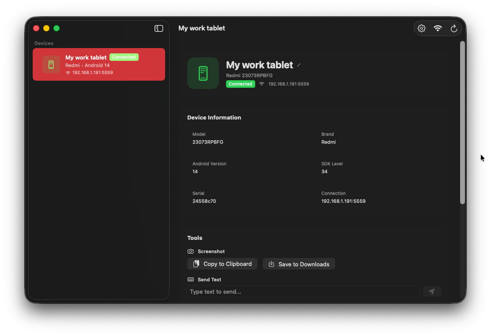
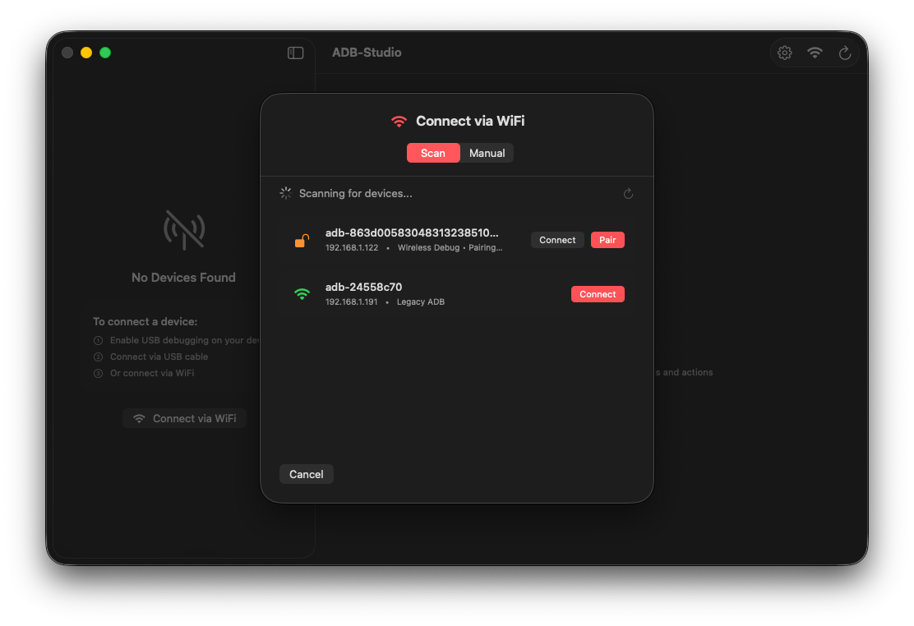
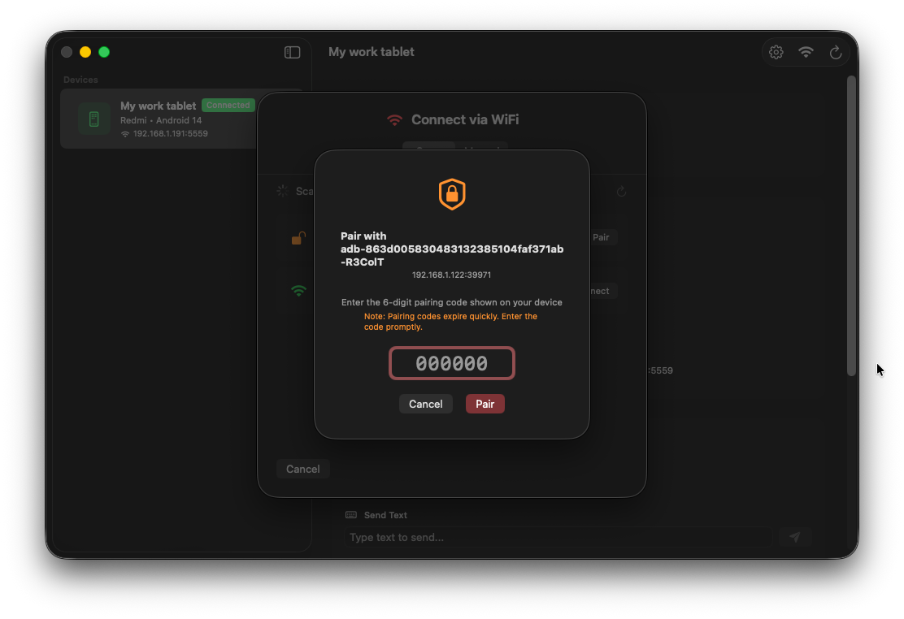
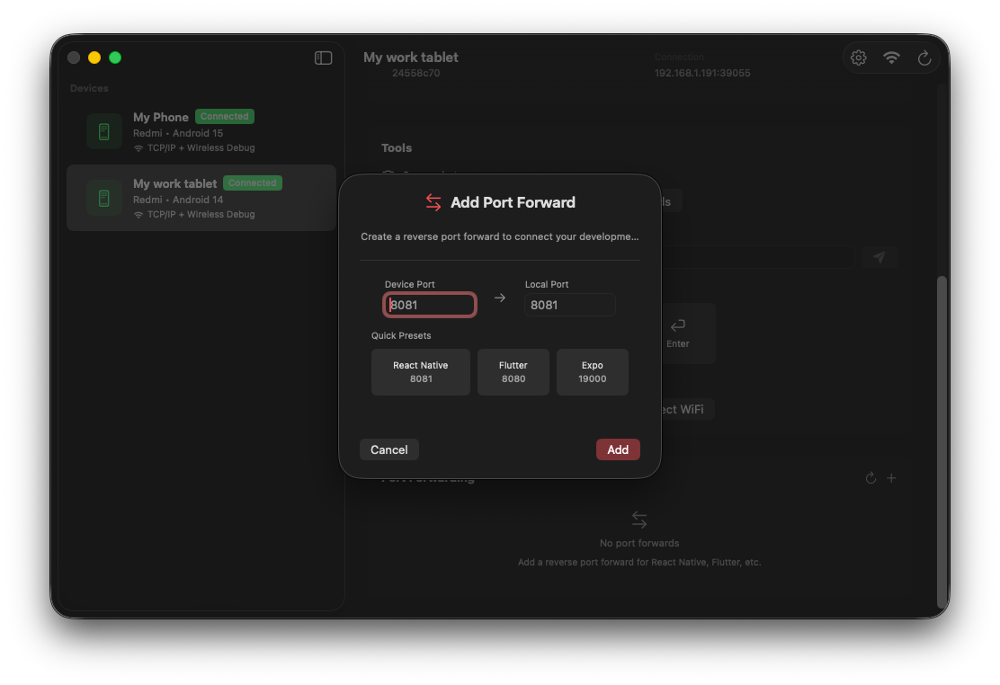

<p align="center">
  
</p>

<p align="center">
  A beautiful, native macOS app for managing Android devices via ADB.
</p>

<p align="center">
  <a href="https://github.com/Zaphkiel-Ivanovna/adb-studio/releases">
    
  </a>
  <a href="https://github.com/Zaphkiel-Ivanovna/adb-studio/blob/main/LICENSE">
    
  </a>
  <a href="https://github.com/Zaphkiel-Ivanovna/adb-studio/stargazers">
    
  </a>
</p>

<p align="center">
  
  
  
</p>

<br>

## Screenshots

<table>
  <tr>
    <td></td>
    <td></td>
  </tr>
  <tr>
    <td align="center"><em>Device Details</em></td>
    <td align="center"><em>Device Search</em></td>
  </tr>
  <tr>
    <td></td>
    <td></td>
  </tr>
  <tr>
    <td align="center"><em>Device Pairing</em></td>
    <td align="center"><em>Port Forwarding</em></td>
  </tr>
</table>

---

## About

ADB Studio is a modern, native macOS application designed to simplify Android device management through ADB. Built entirely with SwiftUI, it provides a clean and intuitive interface for developers and power users who work with Android devices daily.

No more memorizing ADB commands or switching between terminal windows. ADB Studio brings all essential device management features into a beautiful, unified interface.

## Features

- **Automatic Device Discovery** — Detects Android devices via mDNS/Bonjour for seamless wireless connections
- **USB & WiFi Support** — Connect devices via USB cable or wirelessly over your local network
- **One-Click Pairing** — Pair new devices for wireless debugging with just a few clicks
- **APK Installation** — Drag & drop APK files to install apps directly on your device
- **App Management** — View, launch, disable, and uninstall installed apps on your device
- **Screenshot Capture** — Take screenshots instantly and copy to clipboard or save to Downloads
- **Text Input** — Send text directly to your Android device from your Mac keyboard
- **Quick Actions** — Back, Home, Menu, and Enter buttons for rapid navigation
- **Port Forwarding** — Manage reverse TCP ports for development servers (React Native, etc.)
- **TCP/IP Mode** — Enable wireless debugging on USB-connected devices
- **Device History** — Remember devices and assign custom names for easy identification
- **Native Performance** — Built with SwiftUI for a fast, responsive experience

## Requirements

- macOS 14.0 (Sonoma) or later
- ADB installed via:
    - [Android Studio](https://developer.android.com/studio)
    - Homebrew: `brew install android-platform-tools`
    - Or manually in `~/Library/Android/sdk/platform-tools`

## Installation

### Download

Download the latest release from the [Releases](https://github.com/Zaphkiel-Ivanovna/adb-studio/releases) page:

- **DMG** — Drag to Applications folder
- **ZIP** — Extract and move to Applications

> **Note:** Since the app is not notarized, macOS may show a warning. To open it:
>
> - Right-click the app → Open → Open, or
> - Run `xattr -cr /Applications/ADB-Studio.app` in Terminal

### Build from Source

```bash
# Clone the repository
git clone https://github.com/Zaphkiel-Ivanovna/adb-studio.git
cd adb-studio

# Build with Xcode
xcodebuild -scheme "ADB-Studio" -configuration Release build

# Or open in Xcode
open ADB-Studio.xcodeproj
```

## Usage

### Connecting Devices

#### Via USB

1. Enable **Developer Options** and **USB Debugging** on your Android device
2. Connect your device via USB cable
3. The device will appear automatically in ADB Studio

#### Via WiFi (Wireless Debugging)

1. Enable **Wireless Debugging** in Developer Options on your Android device
2. Click **Connect via WiFi** (⌘K) in ADB Studio
3. **Scan** — Devices on your network are discovered automatically
4. **Pair** — For first-time connections, enter the 6-digit pairing code
5. **Connect** — Click to establish the connection

### Tools

| Tool              | Description                                        |
| ----------------- | -------------------------------------------------- |
| **Screenshot**    | Capture device screen to clipboard or save as PNG  |
| **Send Text**     | Type on your Mac, send to Android device           |
| **Quick Actions** | Back, Home, Menu, Enter buttons                    |
| **TCP/IP Mode**   | Enable wireless debugging via USB                  |
| **Install APK**   | Drag & drop or select APK files to install         |
| **Manage Apps**   | Browse, search, and manage installed applications  |

### Port Forwarding

Perfect for React Native, Expo, or any development server:

1. Select a connected device
2. Go to the **Ports** section
3. Click **Add Port**
4. Enter the port number (e.g., `8081` for Metro)
5. The reverse tunnel is created automatically

### APK Installation

Install apps directly from your Mac:

1. Select a connected device
2. **Drag & drop** an APK file onto the drop zone, or **click** to open a file picker
3. The installation progress is displayed in real-time
4. Cancel anytime if needed — the installation process will be terminated

### App Management

View and manage all installed applications on your device:

1. Select a connected device
2. Expand the **Installed Apps** section
3. Use the filter to show: **User Apps**, **System**, **All**, or **Disabled**
4. Search apps by name or package name
5. Click the **...** menu on any app to:
   - **Launch** — Open the app on device
   - **Force Stop** — Stop the running app
   - **Uninstall** — Remove the app (with confirmation)
   - **Uninstall (Keep Data)** — Remove app but preserve data
   - **Disable/Enable** — Toggle app without uninstalling
   - **App Settings** — Open Android settings for this app

> **Note:** System apps cannot be uninstalled but can be disabled.

## Keyboard Shortcuts

| Shortcut | Action           |
| -------- | ---------------- |
| `⌘R`     | Refresh devices  |
| `⌘K`     | Connect via WiFi |
| `⌘,`     | Open Settings    |

## Tech Stack

- **Language**: Swift 5.9+
- **UI Framework**: SwiftUI
- **Target**: macOS 14+ (Sonoma)
- **Architecture**: MVVM with dependency injection
- **Device Discovery**: mDNS/Bonjour (Network framework)

## Project Structure

```
ADB-Studio/
├── App/
│   ├── ADB_StudioApp.swift       # App entry point
│   └── DependencyContainer.swift # DI container
├── Models/
│   ├── Device.swift              # Device model
│   ├── DeviceConnection.swift    # Connection types
│   ├── PortForward.swift         # Port forwarding
│   ├── InstalledApp.swift        # Installed app model
│   └── ADBError.swift            # Error types
├── Services/
│   ├── ADB/                      # ADB command execution
│   ├── Device/                   # Device management
│   ├── Discovery/                # mDNS discovery
│   ├── Media/                    # Screenshot service
│   └── Shell/                    # Process execution
├── ViewModels/
│   ├── DeviceDetailViewModel.swift
│   └── InstalledAppsViewModel.swift
└── Views/
    ├── Main/                     # Main window views
    ├── DeviceList/               # Device list components
    ├── DeviceDetail/             # Device detail views
    ├── Connection/               # WiFi connection sheet
    ├── PortForward/              # Port forwarding views
    ├── APKInstaller/             # APK installation views
    ├── InstalledApps/            # App management views
    ├── Tools/                    # Device tools
    └── Settings/                 # App settings
```

## Contributing

Contributions are welcome! Please feel free to submit a Pull Request.

1. Fork the repository
2. Create your feature branch (`git checkout -b feature/amazing-feature`)
3. Commit your changes (`git commit -m 'Add amazing feature'`)
4. Push to the branch (`git push origin feature/amazing-feature`)
5. Open a Pull Request

## Support

If you find ADB Studio useful, consider supporting its development:

<a href="https://ko-fi.com/T6T4E5BP6">
  
</a>

## License

This project is licensed under the MIT License - see the [LICENSE](LICENSE) file for details.

## Acknowledgements

- [Android Debug Bridge (ADB)](https://developer.android.com/tools/adb) by Google
- Built with [SwiftUI](https://developer.apple.com/swiftui/)

---

<p align="center">
  Made with ❤️ by Zaphkiel Ivanovna
</p>
